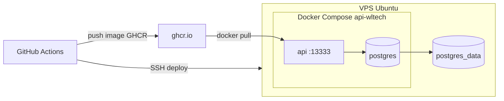
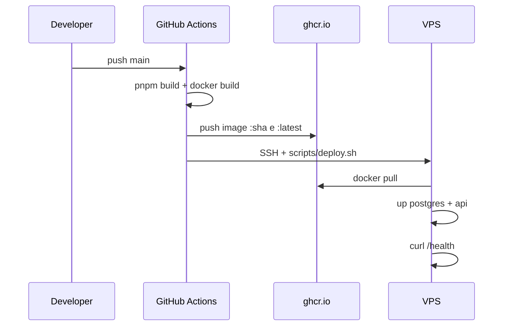

# Deploy da API WLTech na VPS

Guia para subir a API e o PostgreSQL em produção com Docker, persistência de dados e deploy automático via GitHub Actions.

## Arquitetura



| Componente | Porta no host | Observação |
|------------|---------------|------------|
| API | `13333` (configurável via `API_PORT`) | única porta publicada deste projeto |
| PostgreSQL | **não publicada** | acessível só na rede Docker interna |

---

## 1. Preparar a VPS (Ubuntu/Debian)

### 1.1 Usuário dedicado e diretório

```bash
sudo adduser --disabled-password --gecos "" deploy
sudo usermod -aG docker deploy
sudo mkdir -p /opt/api-wltech
sudo chown deploy:deploy /opt/api-wltech
```

### 1.2 Instalar Docker

```bash
curl -fsSL https://get.docker.com | sudo sh
sudo usermod -aG docker $USER
```

Reconecte na VPS para aplicar o grupo `docker`.

### 1.3 Firewall

```bash
sudo ufw allow OpenSSH
sudo ufw allow 13333/tcp
sudo ufw enable
```

Se possível, restrinja `13333` a IPs confiáveis:

```bash
sudo ufw allow from SEU_IP to any port 13333 proto tcp
```

### 1.4 Chave SSH para GitHub Actions

No seu computador:

```bash
ssh-keygen -t ed25519 -C "github-actions-api-wltech" -f ~/.ssh/api-wltech-deploy
```

Copie a chave **pública** para a VPS (`~deploy/.ssh/authorized_keys`) e guarde a **privada** como secret `VPS_SSH_KEY` no GitHub.

---

## 2. Clonar o projeto na VPS

```bash
sudo -u deploy -H bash
cd /opt/api-wltech
git clone https://github.com/Weverson-Luan/api-wltech.git .
cp .env.production.example .env.production
```

Edite `.env.production` com valores reais:

- `POSTGRES_PASSWORD` — senha forte
- `DATABASE_URL` — deve apontar para `postgres` como host
- `JWT_SECRET` — mínimo 32 caracteres
- `API_PORT=13333` — evita conflito com outros projetos Docker
- `API_IMAGE` — tag GHCR do repositório

Gere um segredo JWT:

```bash
openssl rand -base64 48
```

### Login no GHCR (primeira vez)

Crie um Personal Access Token com `read:packages` e faça login na VPS:

```bash
echo "SEU_PAT" | docker login ghcr.io -u SEU_USUARIO_GITHUB --password-stdin
```

Para repositório/pacote privado, configure também o secret `VPS_GHCR_TOKEN` no GitHub.

---

## 3. Primeiro deploy manual

```bash
cd /opt/api-wltech
chmod +x scripts/deploy.sh

docker compose -f docker-compose.prod.yml --env-file .env.production up -d
```

### Migrations (manual)

Migrations não rodam automaticamente no deploy por enquanto. Na **primeira vez** e sempre que houver alteração de schema:

```bash
cd /opt/api-wltech
pnpm install
pnpm db:migrate
```

Para isso, o PostgreSQL precisa estar acessível. Opções:

- rodar `pnpm db:migrate` na sua máquina apontando para a VPS (não recomendado em produção), ou
- instalar Node/pnpm na VPS e apontar `DATABASE_URL` para `localhost` **somente se** expuser temporariamente o Postgres (não faça isso), ou
- executar na VPS com tunnel/rede interna usando um container one-off com o código do repo:

```bash
docker compose -f docker-compose.prod.yml --env-file .env.production up -d postgres
docker run --rm --network api-wltech_internal \
  -v "$(pwd):/app" -w /app \
  --env-file .env.production \
  node:22-alpine sh -c "corepack enable && pnpm install && pnpm db:migrate"
```

Validar:

```bash
curl http://127.0.0.1:13333/health
```

> O seed de desenvolvimento **não** roda em produção. Crie o primeiro usuário via endpoint de registro.

---

## 4. GitHub Actions (deploy automático em produção)

Workflow: [`.github/workflows/deploy.yml`](../.github/workflows/deploy.yml)

**Gatilhos:**
- push na branch `main` → deploy automático
- botão **Run workflow** no GitHub (deploy manual)

### Passo a passo no GitHub

1. Vá em **Settings → Secrets and variables → Actions**
2. Crie os secrets abaixo
3. (Opcional) Crie o environment **production** em **Settings → Environments** para controlar aprovações
4. Faça push na `main` ou dispare o workflow manualmente

### Secrets obrigatórios

| Secret | Descrição | Exemplo |
|--------|-----------|---------|
| `VPS_HOST` | IP ou hostname da VPS | `203.0.113.10` |
| `VPS_USER` | usuário SSH com acesso ao Docker | `deploy` |
| `VPS_SSH_KEY` | chave privada ed25519 (conteúdo completo do arquivo) | conteúdo de `api-wltech-deploy` |

### Secrets opcionais

| Secret | Descrição |
|--------|-----------|
| `VPS_SSH_PORT` | padrão `22` |
| `VPS_GHCR_TOKEN` | PAT com `read:packages` — necessário se o pacote GHCR for **privado** |

### Como gerar a chave SSH para o Actions

No seu computador:

```bash
ssh-keygen -t ed25519 -C "github-actions-api-wltech" -f ~/.ssh/api-wltech-deploy -N ""
cat ~/.ssh/api-wltech-deploy.pub   # coloque na VPS em ~/.ssh/authorized_keys
cat ~/.ssh/api-wltech-deploy       # copie TUDO para o secret VPS_SSH_KEY
```

Na VPS, confirme que o usuário `deploy` aceita a chave:

```bash
mkdir -p ~/.ssh && chmod 700 ~/.ssh
echo "SUA_CHAVE_PUBLICA" >> ~/.ssh/authorized_keys
chmod 600 ~/.ssh/authorized_keys
```

### Fluxo a cada deploy



1. Build da imagem Docker e push para `ghcr.io/weverson-luan/api-wltech:SHA`
2. SSH na VPS → `git pull` → `docker pull` → sobe postgres + API
3. Healthcheck em `http://127.0.0.1:13333/health`
4. Se falhar, tentativa de rollback para a imagem anterior

### Disparar deploy manual

No GitHub: **Actions → Deploy to Production → Run workflow**

### Verificar se funcionou

```bash
# Na VPS
docker compose -f docker-compose.prod.yml --env-file .env.production ps
curl http://127.0.0.1:13333/health
```

No GitHub: aba **Actions** do repositório — job verde = deploy OK.

---

## 5. Operação do dia a dia

### Logs

```bash
docker compose -f docker-compose.prod.yml --env-file .env.production logs -f api
docker compose -f docker-compose.prod.yml --env-file .env.production logs -f postgres
```

### Deploy manual (mesmo fluxo do CI)

```bash
cd /opt/api-wltech
./scripts/deploy.sh
```

### Verificar persistência

```bash
docker compose -f docker-compose.prod.yml --env-file .env.production restart postgres api
curl http://127.0.0.1:13333/health
```

Os dados permanecem no volume `api-wltech_postgres_data`.

---

## 6. Portas para múltiplos projetos

Cada projeto Docker na mesma VPS deve usar:

- **rede Compose isolada** (`internal`)
- **porta HTTP exclusiva no host** (`API_PORT`)
- **PostgreSQL sem bind no host**

Sugestão de mapa:

| Projeto | API_PORT |
|---------|----------|
| api-wltech | `13333` |
| próximo projeto | `13334`, `13335`, ... |

---

## 7. Próximo passo: domínio e HTTPS

Quando tiver domínio, coloque um proxy reverso compartilhado (Caddy, Traefik ou Nginx) nas portas `80/443` apontando para `127.0.0.1:13333`.

Até lá, acesso por IP na porta `13333` é adequado para validação interna, mas **não** recomendado para produção pública com autenticação JWT sem TLS.

---

## 8. Checklist para novo desenvolvedor

1. Clonar o repositório
2. `pnpm install && cp .env.example .env`
3. `pnpm setup` (dev local)
4. Alterar schema → `pnpm db:generate` → commitar SQL em `drizzle/`
5. Push na `main` dispara deploy automático da API
6. Rodar migrations manualmente na VPS quando houver mudança de schema
